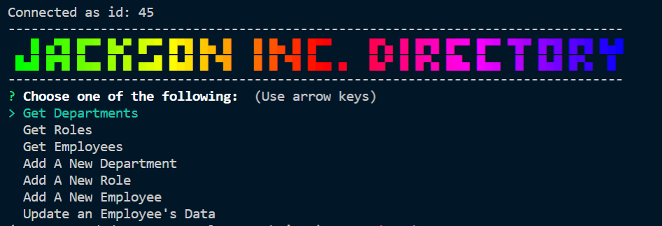

# IncDbCli

A company directory CLI using Node, Inquirer, and a SQL database with Typescript



## Prerequisites

<a href="https://nodejs.org/en/"></a>

<a href="https://www.mysql.com/"></a>
## Installation

Use Node JS command line to install packages

```bash
npm i
```

## Usage

```bash
npm run start
```

## Running Tests

```bash
npm run test
```

## Deployment

N/A

## Authors

[Jon Jackson](http://github.com/ocskier)

## Contributing
Please make sure to update tests as appropriate.

## License

